# Lab 1: Accessing your Lab [5 minutes]

All components for this lab can be accessed through a web browser on the Lab PC. **No VPN or app installations are required.**

### Step 1.1: Accessing your Lab session from the Lab PC

On your Lab PC, open a web session in chrome browser. Open the link below –

The url is also shared in the Lab Webex space.

1. Click “Explore” once you get the page below. Click “Explore” once you get the page below, confirm your LabID: LAB-21074.

    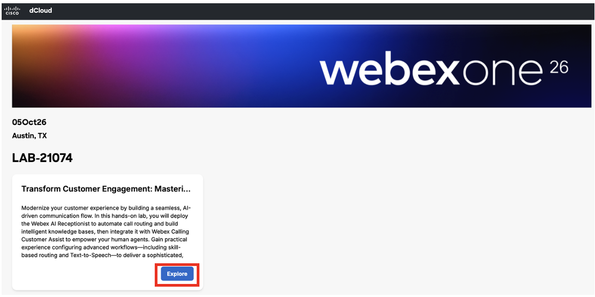{ .bordered }

2. Type in your email address, click on the check-box and click “Launch” to get started with your lab.

    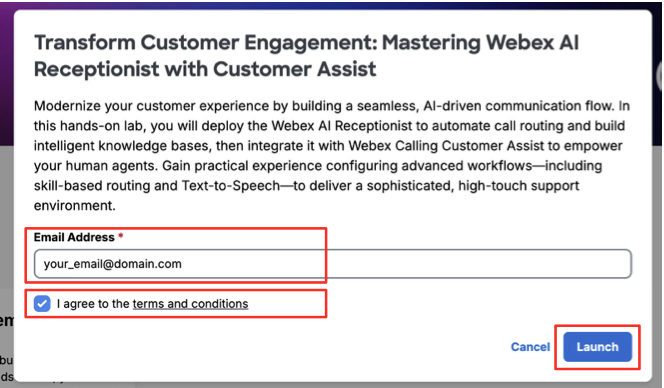{ .bordered }

3. On the next screen you would see “Lab-21074” and “View Session” tab where you could see the topology. When you are done you can click “Logout and End Session”. In this lab you would be using “wkst1”, click “**Open**”.

    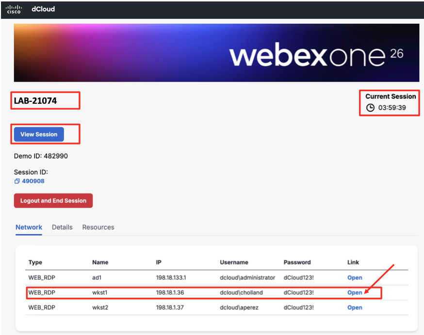{ .bordered }

4. Select “Allow” if you see similar window pop-up like the below:

    { .bordered width="742" }

### Step 1.2: Access Control Hub from Lab PC

1. Once you are in the Workstation1 it will be automatically logged in as “Charles Holland”.

2. Sort the Desktop files by “Name” and open the file “WEBEX\_PASSWORD.txt”

    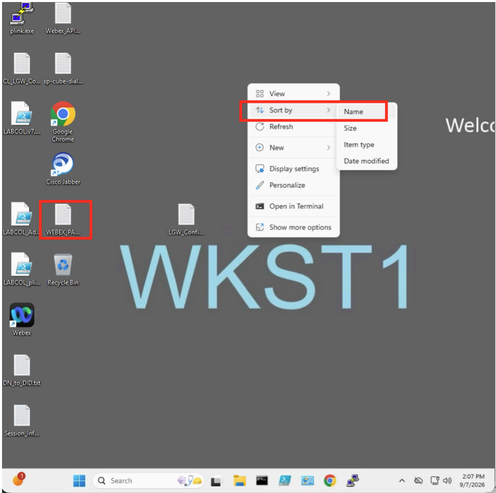{ .bordered }

3. Once the file is opened, make note of domain part and password.

    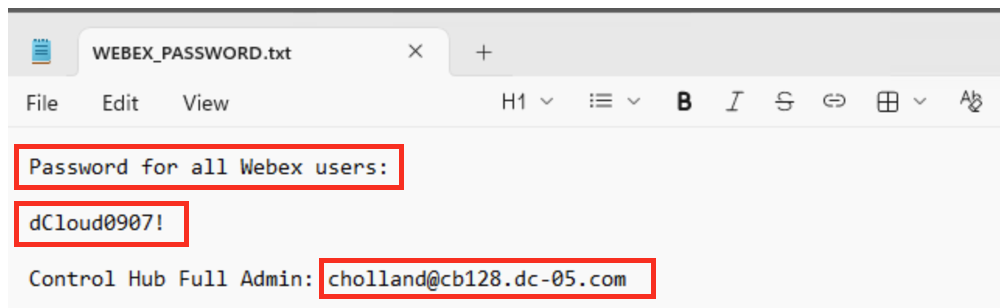{ .bordered }

    From the above, the username for Control Hub Full Admin is [**cholland@cb128.dc-05.com**](mailto:cholland@cb128.dc-05.com) and password is “**dCloud0907!**”.

    !!! note "Note"
        1. User IDs (prefix before the @ sign) are the same across all Lab instances.
        2. Domains and passwords are unique for each lab instances.
        3. Passwords are the same for all user within same lab instances.
        4. Use full email address format to login to Control Hub and Webex app

        For this lab example:

        | User | User ID | Email Address | Password |
        | --- | --- | --- | --- |
        | Charles Holland | cholland | cholland@cb128.dc-05.com | dCloud0907! |
        | Anita Perez | aperez | aperez@cb128.dc-05.com | dCloud0907! |

4. Open new Chrome web browser tab in **Lab PC** to login to the Control Hub with Charles Holland credential.

    Control Hub Admin url: admin.webex.com

5. You can select “Reject” for *This site uses cookies* pop-up window prompt – no impact to functionality. And select “No, thanks” at *Meet the Cisco AI Assistant* prompt to skip AI Assistant tour.

    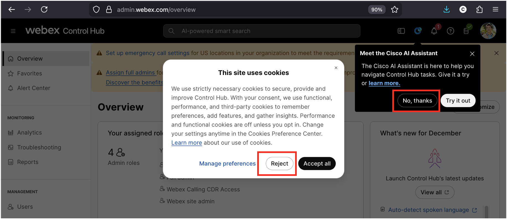{ .bordered }

### Step 1.3: Change Control Hub idle timeout

1. Under Management, click on “Organization Settings”

2. Scroll down until you can see “Control Hub’s idle timeout”

3. Change the value from 20 minutes (Default) to “4 hours”

    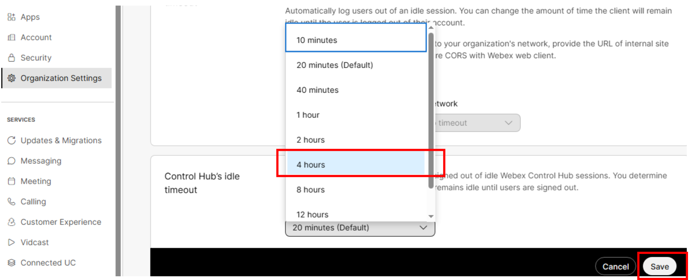{ .bordered }

4. Click “Save”

### Step 1.4: Organization Level Webex Calling License

1. Under Management, click on “Account” > click on “Subscriptions” tab

2. In the License Summary section, verify calling license shown in “Calling” section including “AI Receptionist” and “Customer Assist”.

    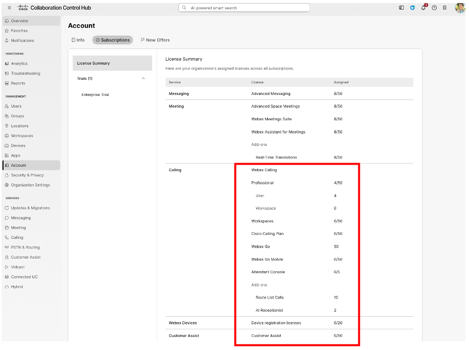{ .bordered }

    |  |  |
    | --- | --- |
    |  | **Note:**  License assignment is listed in xx/yy format.   * xx = license assigned to users or workstation * yy = total available license in your subscription |

### Step 1.5: Users and their Calling License Assignment

1. Under Management, click on “Users”.

2. Total of eight users already added and shown with their email addresses.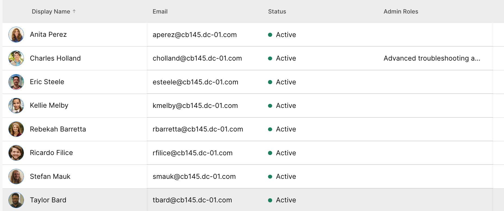{ .bordered }

3. Let’s check user’s license and calling view for these two users. Start by left click on the username.

    * Charles Holland – **has calling** license assigned:

    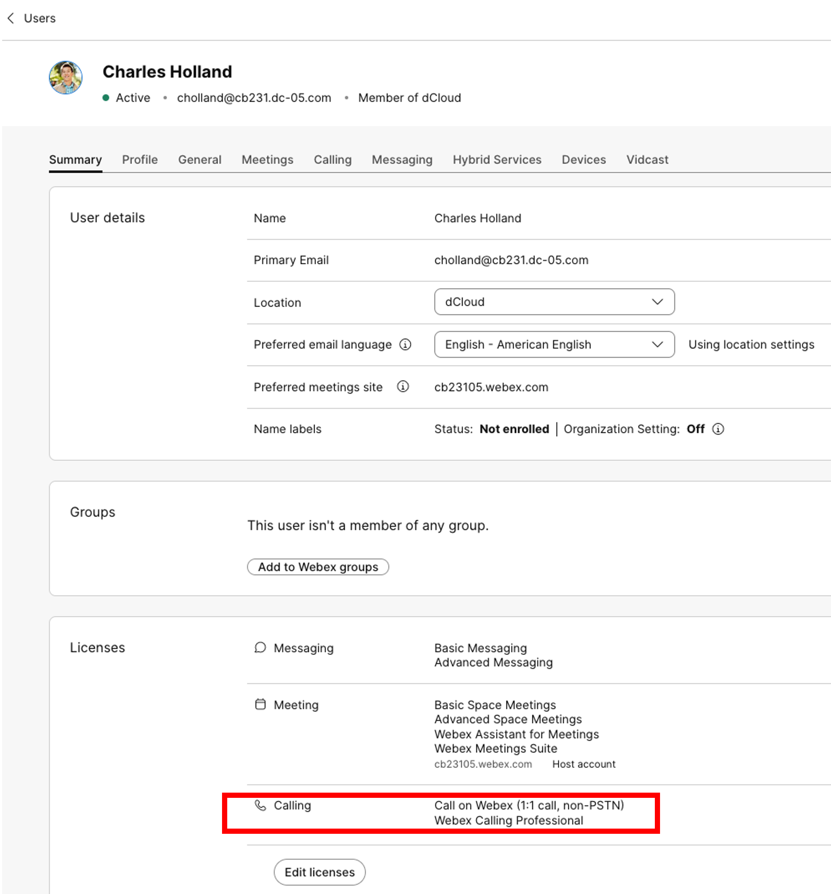{ .bordered }

    * Calling tab view with Directory Number detail assign to Charles Holland:

    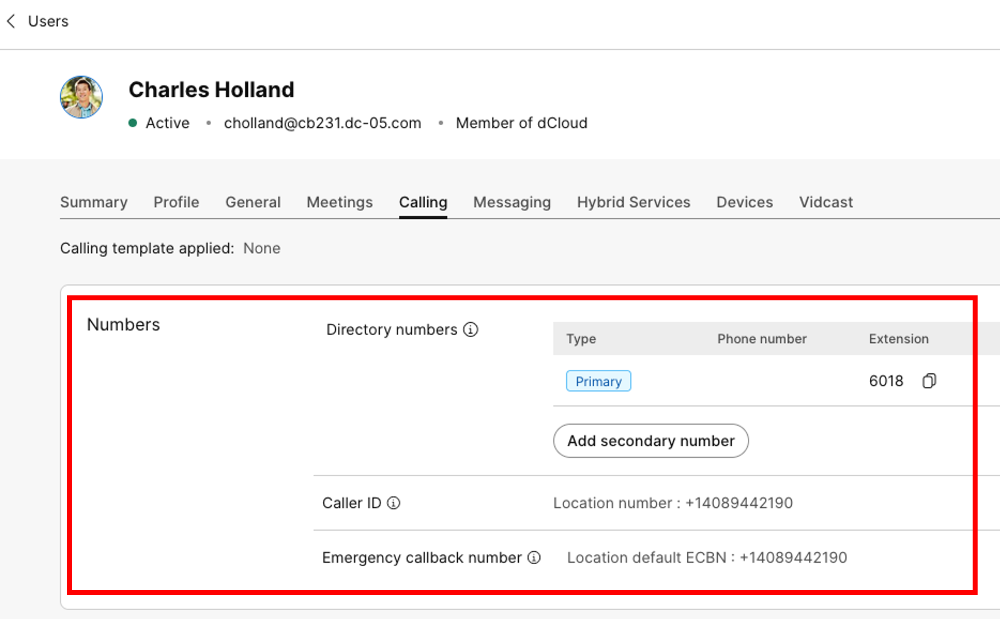{ .bordered }

    * Follow the same steps for Anita Perez.

### Step 1.6: Validate Location PSTN Type and Main number

At this step, you will be verifying PSTN type for dCloud location.

1. Under Management, click on “Locations”

2. Click on “dCloud” > navigate and click on “Calling” tab

3. Verify that PSTN Connection = Premised-based PSTN, and a number is assigned to the Main number field.

    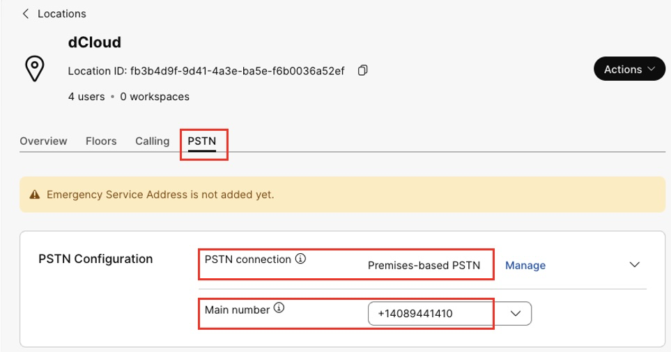{ .bordered }

### Step 1.7: Verify Configured Numbers

1. In Control Hub’s Services section, select “PSTN and Routing” and click on Number tab. It will list all configured numbers.

    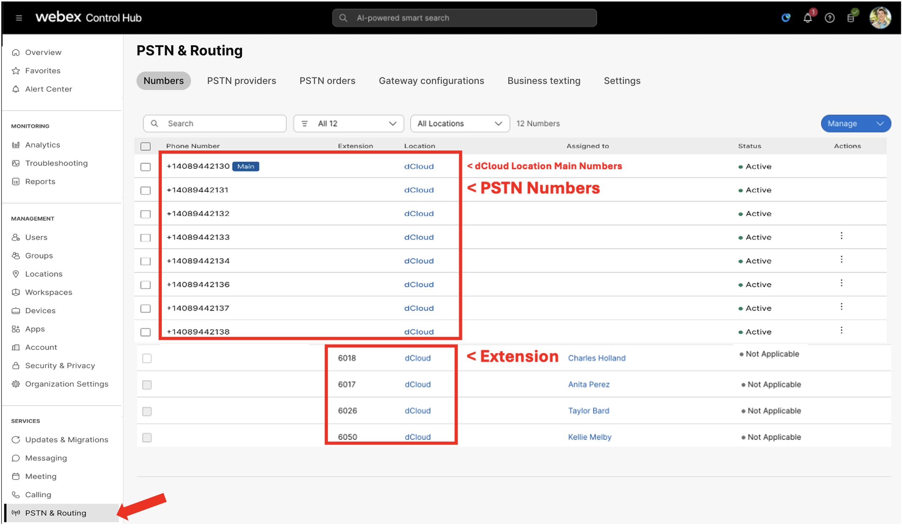{ .bordered }

    |  |  |
    | --- | --- |
    |  | **Note:**   * **Assign the dCloud Location Main Number to the AI Receptionist;** note that this PSTN number varies by lab instance. * In **Testing and Call Flow** section **–** you will be using **extension 6500** (configured later) **to reach AI Receptionist** from Webex app. |
