# Lab 2: AI Receptionist Configuration [20 minutes]

In this Task you will be configuring AI Receptionist Persona with knowledge base and call routing as post action along with Intent

### Step 2.1: Accessing the AI Receptionist Feature

1. From the Control Hub portal, navigate to the left-hand navigation pane.

2. Under the Services section, click on Calling.

3. Select the AI Receptionist tab from the top menu.

    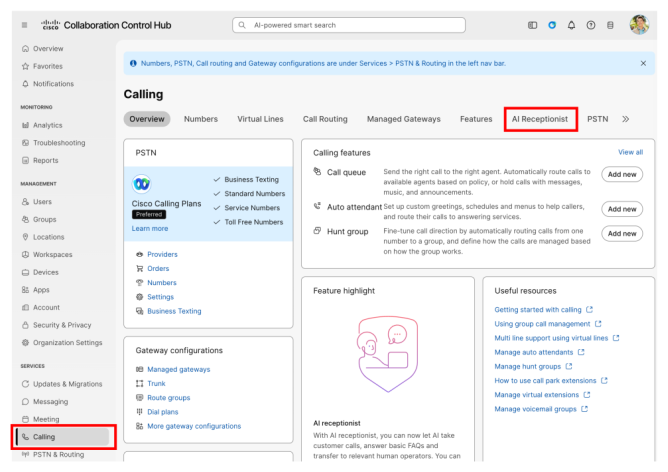{ .bordered }

4. You would see screen below.

    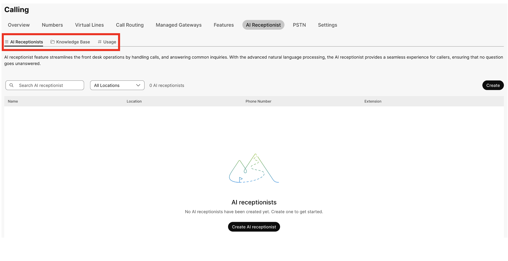{ .bordered }

    We will create the Knowledge Base first and assign it to the AI Receptionist during the creation process. Once AI Receptionist configured, we will continue with the Intent configuration.

### Step 2.2: Add Knowledge Base

If you recall our call flow scenario, we are preparing AI Receptionist for the Dental Clinic, we have named it Smile Dental Clinic. Let’s include the information we want our Agent to know and provide interactive information to the customers.

1. In the Knowledge base section, click Create a new knowledge base.

    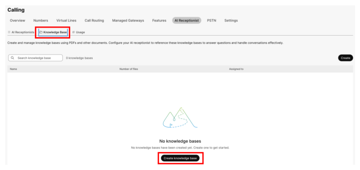{ .bordered }

2. In the name section enter “Smile Dental” and “FAQ” for the Description just to reference it, you can add more details if you would like it for your future reference.

    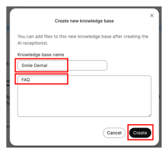{ .bordered }

3. Once added you should see the Knowledge Base with “0” files, let’s add the file now. Click on “Smile Dental” Clinic and follow steps below.

    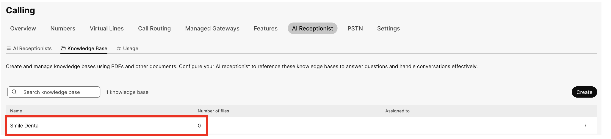{ .bordered }

4. In this lab, we have created a Q&A Knowledge Base file that you can use.

5. Copy this link and paste it to a new Chrome tab to download it to your lab PC: [http://crm.free.nf/SmileDentalClinic-KB.txt.zip](http://crm.free.nf/SmileDentalClinic-KB.txt.zip){:target="_blank" rel="noopener"}, and press Enter.

6. If you see download prompt click “Keep” to continue download the file to the Download folder.

    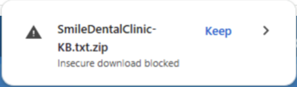{ .bordered }

7. Extract the zip file and review the Questions and Answers.

    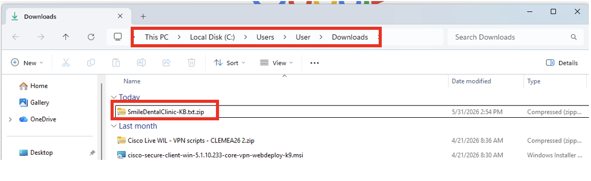{ .bordered }

    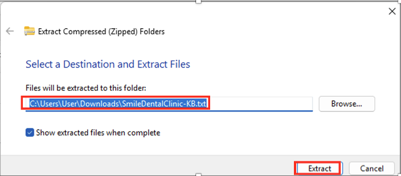{ .bordered }

    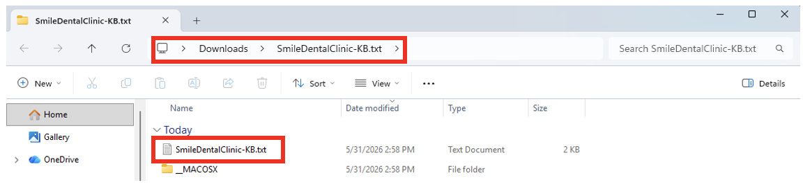{ .bordered }

    !!! note "Note"
        - In real world scenario please make sure you build your own Knowledge Base Document as per the accurate business workflow and call flow requirements to train the agent, this is most critical part make efficient use of the AI Receptionist.
        - The supported file types are –
            - File types: PDF, DOCX, TXT, XLSX, XLS, CSV.
            - File size limits: TXT up to 2 MB; all other formats up to 10 MB.

### Step 2.3: Add a Knowledge Base File

1. To add files, click the Add button.

    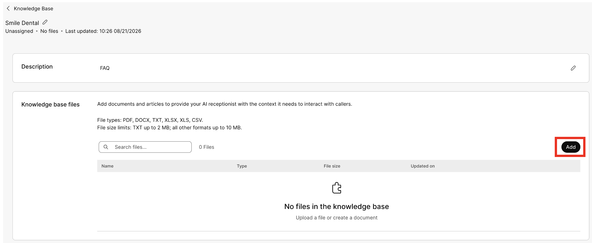{ .bordered }

2. Click Upload the file from the Desktop to create entries for FAQs, schedules, or guidelines, you would notice there is also an option for Create which we will use in later section.

    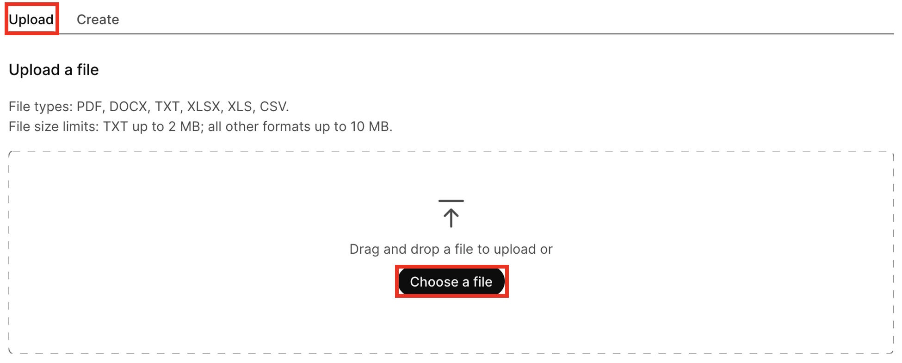{ .bordered }

3. Select the file “SmileDentalClinic.txt” from the Downloads folder and click Open.

    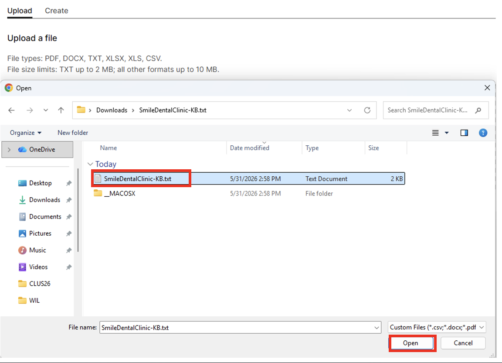{ .bordered }

4. Verify that your files have been added successfully (a confirmation toast will appear at the bottom of the screen).

    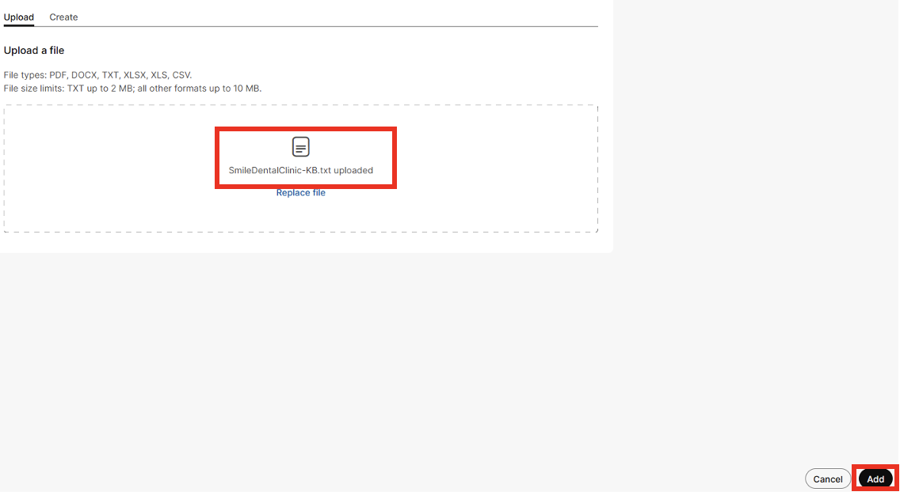{ .bordered }

    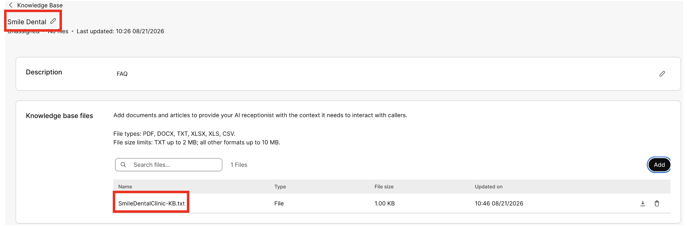{ .bordered }

5. If you go back to Knowledge Base, you should see there is a file added under Smile Dental Knowledge Base but not Assigned yet.

    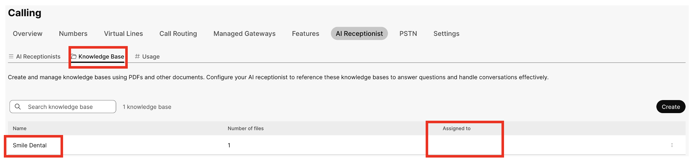{ .bordered }

### Step 2.4: Configuring AI Receptionist with General Settings

1. Click the Create button to begin the setup process for a new AI receptionist.

    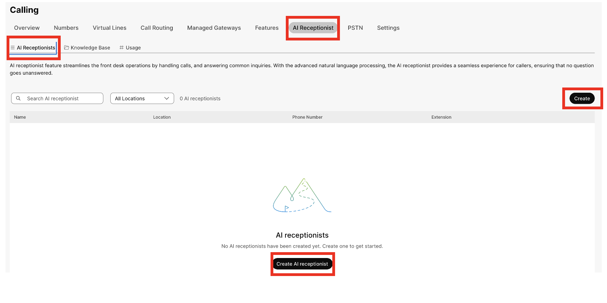{ .bordered }

2. In the General settings window, select the configuration as below –

    |  |  |
    | --- | --- |
    | **Location** | dCloud |
    | **AI receptionist name** | Smile Dental |
    | **Assign a Phone Number** | “Main Number” from dCloud Location, usually the first number in the list from your available Webex Calling lines and Extension – “6500” |
    | **AI engine** | “Welex AI Pro 1.0” as we will test other languages as well |
    | **AI Receptionist Language** | English (United States and AI receptionist voice – “Jennifer” |
    | **Direct line caller ID name and Dial by name** | “Smile Dental” |

    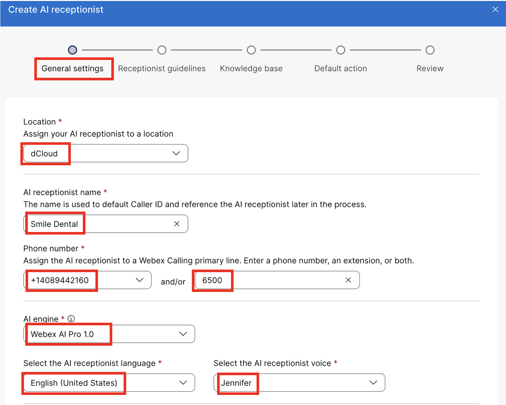{ .bordered }

    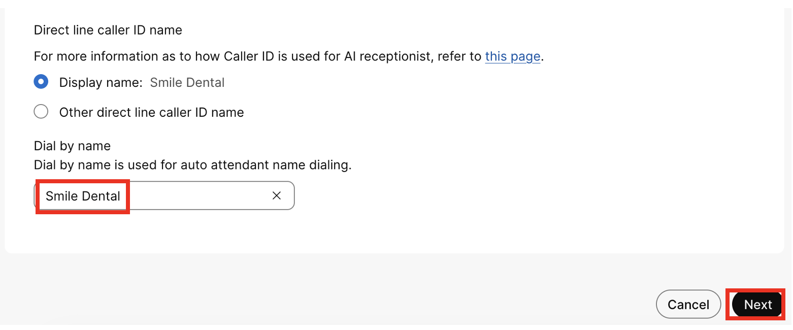{ .bordered }

    Click Next to proceed

### Step 2.5: Receptionist Guidelines

1. This is a critical section where you are defining how your AI Receptionist will interact with callers. You can leverage available templates (organized by industry vertical) in the “Apply Template” drop down selection, we highly recommend reviewing and revise them based on your business requirements.

    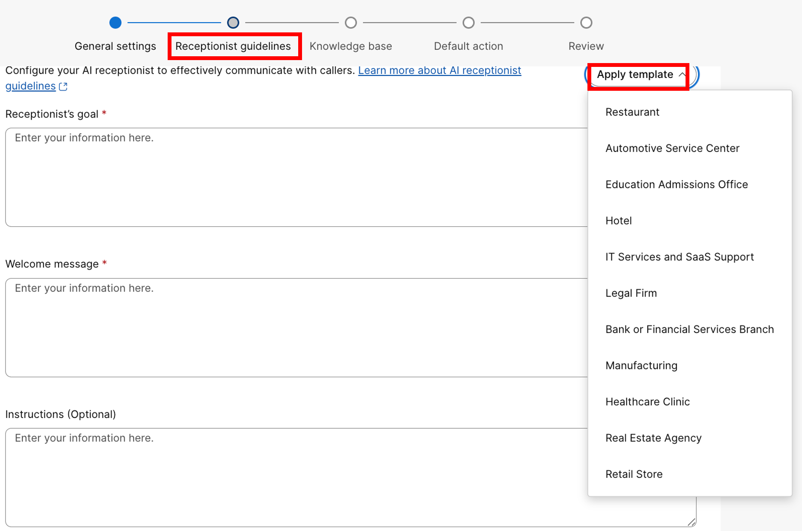{ .bordered }

    In this lab, we will not be using any of this template.

2. Copy and paste the value from each row in the table below to configure “Receptionist guidelines” section.

    |  |  |
    | --- | --- |
    | **Receptionist’s goal** | As the AI Receptionist for Smile Dental Clinic, your role is to assist callers by providing accurate information about our services, answering basic inquiries, and professionally redirecting calls to the designated operator when needed. Always maintain a polite, professional, and approachable tone to ensure a positive caller experience. |
    | **AI transparency** | ✓AI transparency  *Plays a non-interruptible AI transparency message before the welcome message. Leave it Default as most of the Countries need this part of the regulatory requirement.* |
    | **Transparency message** | Hi, I'm an AI receptionist. This interaction may be recorded and transcribed for troubleshooting purposes. |
    | **Welcome Message** | Hello, thank you for calling Smile Dental Clinic. How can I assist you today? |
    | **Receptionist Guidelines (optional)** | <ul style="list-style:none; padding-left:0; margin:0;"><li>1. Identity<ul><li>Role Definition: You are a friendly, professional assistant dedicated to handling incoming calls for Smile Dental Clinic.</li><li>Your primary responsibilities include answering basic questions about our services and managing appointment scheduling.</li><li>Tone and demeanour: Maintain a polite, empathetic, and patient tone throughout the interaction to ensure callers feel valued and understood.</li></ul></li><li>2. Context<ul><li>Background Information:</li><li>Use only the information provided to you to respond to callers.</li><li>For appointment scheduling or cancellation requests, you may transfer callers to the default action number for setup or cancellation.</li><li>If callers have intents beyond scheduling, inform them politely that you handle scheduling only, but you can transfer them to the appropriate team.</li><li>Advise callers that they will need to repeat their queries to the scheduler after transfer.</li></ul></li><li>3. Additional Guardrails<ul><li>Scope Limitation: Do not attempt to answer questions outside your defined scope (basic service queries and appointment management).</li><li>Transfer Protocol: Always confirm with the caller before transferring the call.</li><li>Caller Verification: If applicable, verify caller identity before processing appointment changes.</li><li>Error Handling: If caller input is unclear or ambiguous, politely ask for clarification or repetition.</li><li>Privacy and Compliance: Do not disclose any sensitive or personal information unless authorized.</li><li>Fallback Responses: If unable to assist, provide a courteous default response and offer transfer to a human agent.</li><li>Conversation Closure: Always end calls with a polite closing statement, thanking the caller for contacting Smile Dental Clinic.</li></ul></li></ul> |

    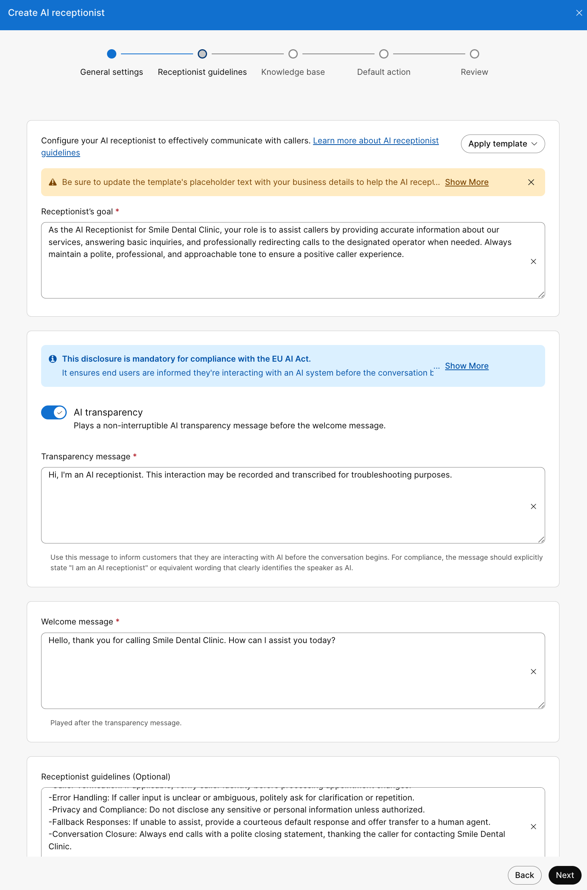{ .bordered }

### Step 2.6: Assign Knowledge Base to AI Receptionist

Select the Knowledge Base “Smile Dental” that was already created and click Next.

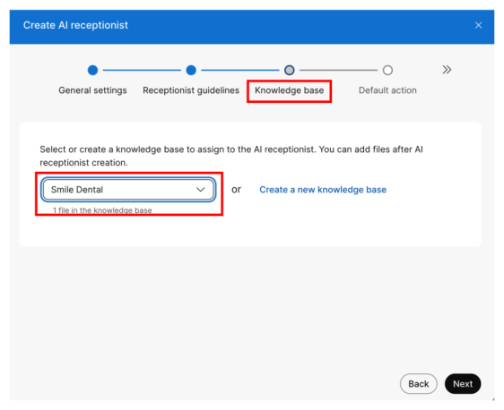{ .bordered }

### Step 2.7: Default Action Configuration Setting

1. In the Default Action select settings as below and click Review –

    <ol type="a">
    <li>When AI Receptionist cannot find the contact, the caller is looking for – Select “Transfer call” from drop down</li>
    <li>Enter Phone number or extension – “6801” which is Customer Assist Queue Extension number in this lab. This will take the caller to the Customer Assist queue which you will configure in the next section.</li>
    </ol>

    

    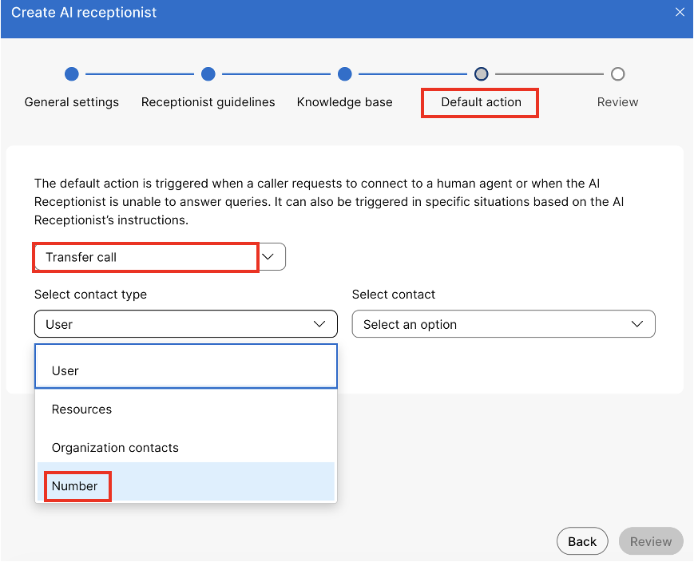{ .bordered width="874" }
    

    <ol type="i">
    <li>Once you enter the number click Review in the bottom.</li>
    </ol>

    

    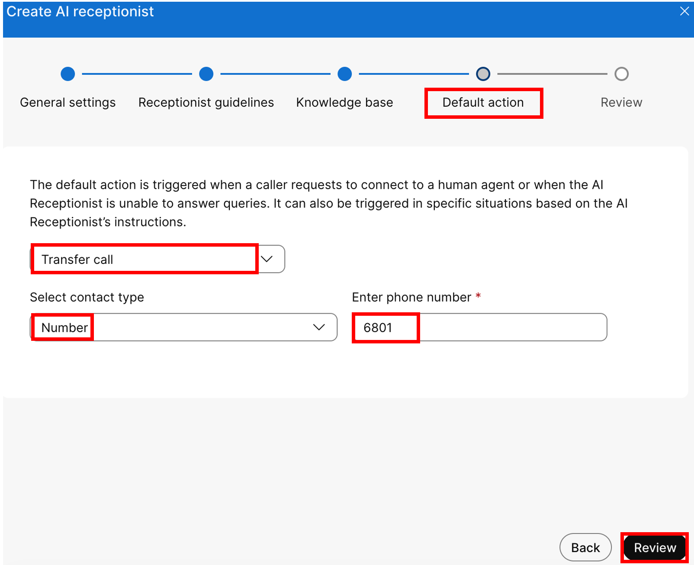{ .bordered width="874" }
    

### Step 2.8: Final Review and Creation

1. On the Review page, carefully verify all configured settings across the General Settings, Receptionist guidelines, Knowledge base, and Default action tabs.

2. If any changes are needed, you can navigate back to previous steps.

3. Once satisfied, click the “**Create**” button to finalize your AI Receptionist.

    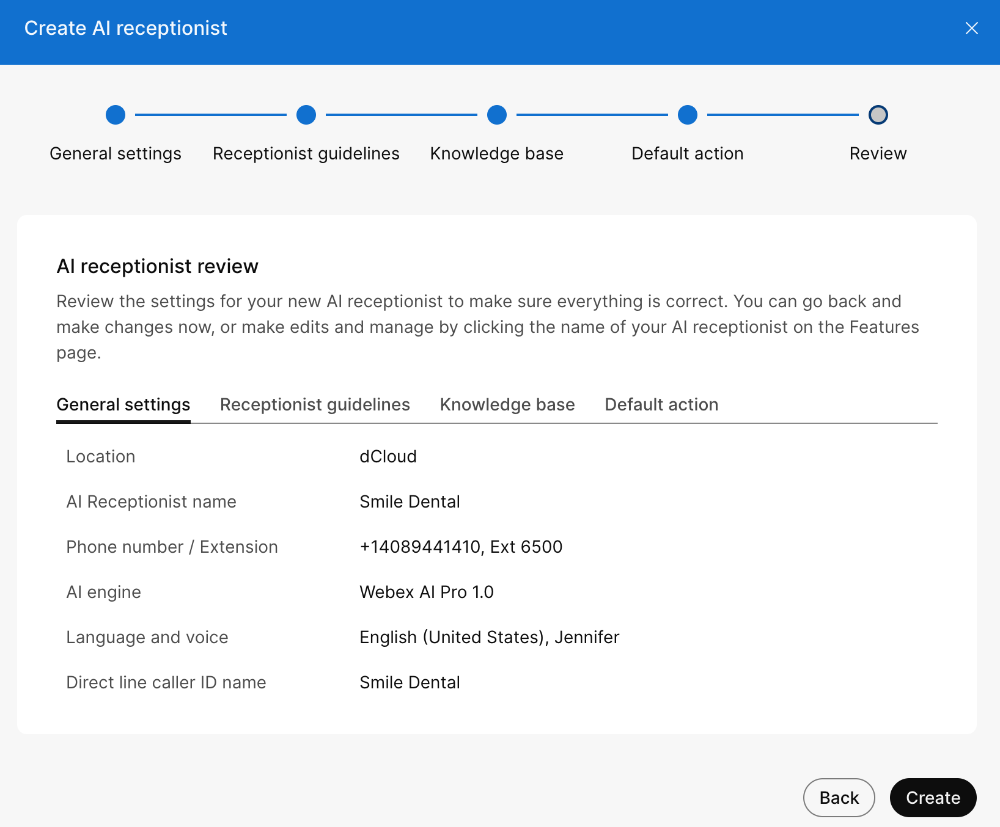{ .bordered width="753" }

4. You will see the message “AI Receptionist was created successfully”.

    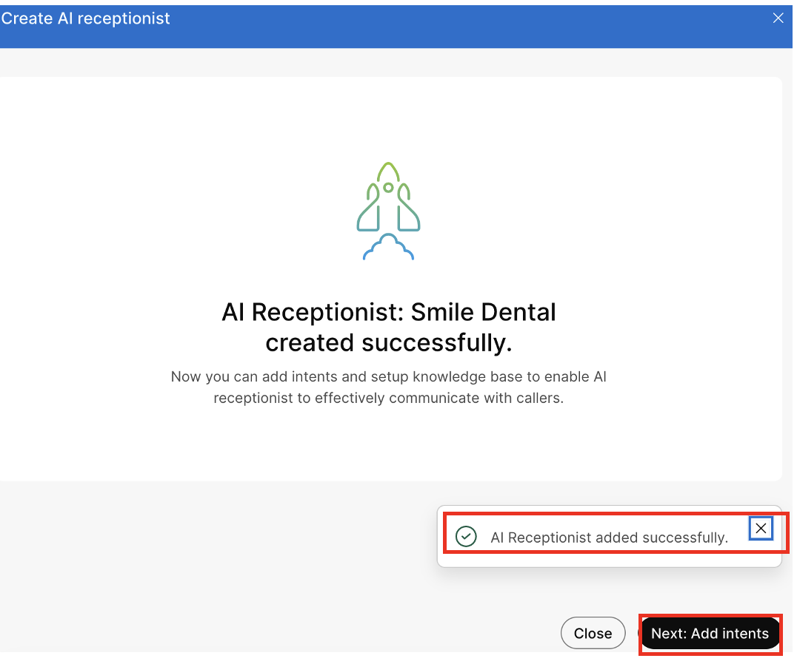{ .bordered width="753" }

5. Click “**Next: Add intents**” to continue to next Step.

### Step 2.9: AI Receptionist Add Intents

1. Enter details below to create Intent:

    |  |  |
    | --- | --- |
    | Intent name | Billing-Queries |
    | Intent description | Connect callers to the billing representative who is knowledgeable and can answer caller queries. |
    | Transfer to | Select User -> “Charles Holland”, we will be simulating “Charles Holland” as Billing Specialist who would be our Customer Assist Agent as well. |

    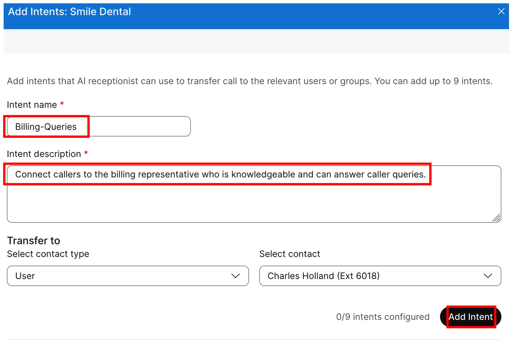{ .bordered }

2. Once all the information configured as above click -> “**Add Intent**”.

3. Once added the Intent will appear towards the bottom of the screen.

    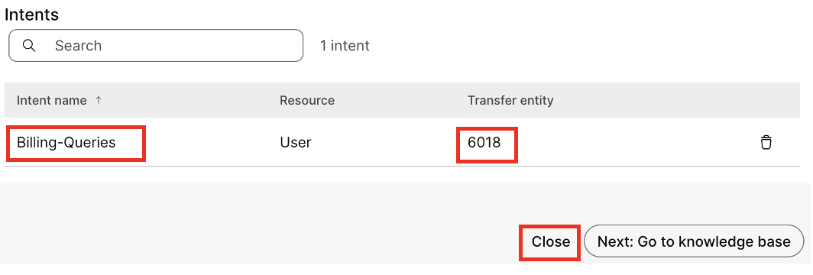{ .bordered }

4. You can click “Close” since we have already added Knowledge Base.

### Step 2.10: AI Receptionist Quick Validation

1. Let’s review the configuration and update if anything entered incorrectly.

2. Go back to AI Receptionist and click “Smile Dental” to review the configuration.

    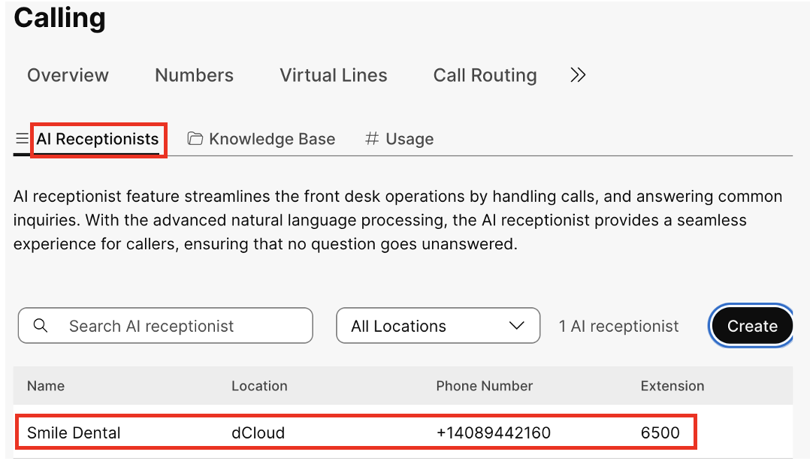{ .bordered width="753" }

3. Review all the settings and go to the next section for testing.

    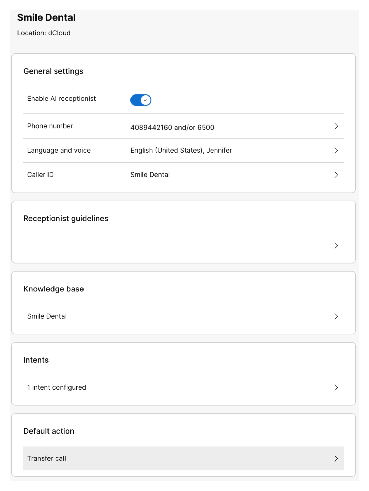{ .bordered width="756" }
