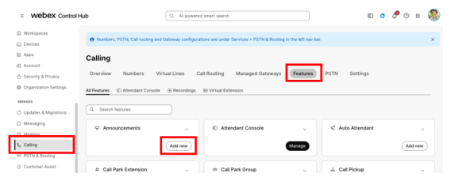
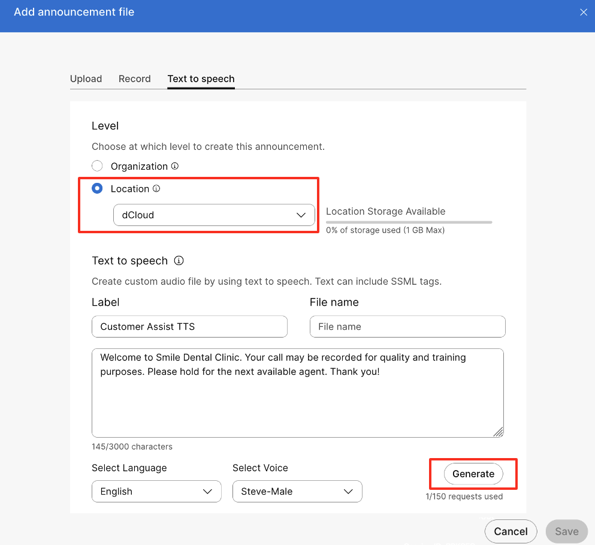
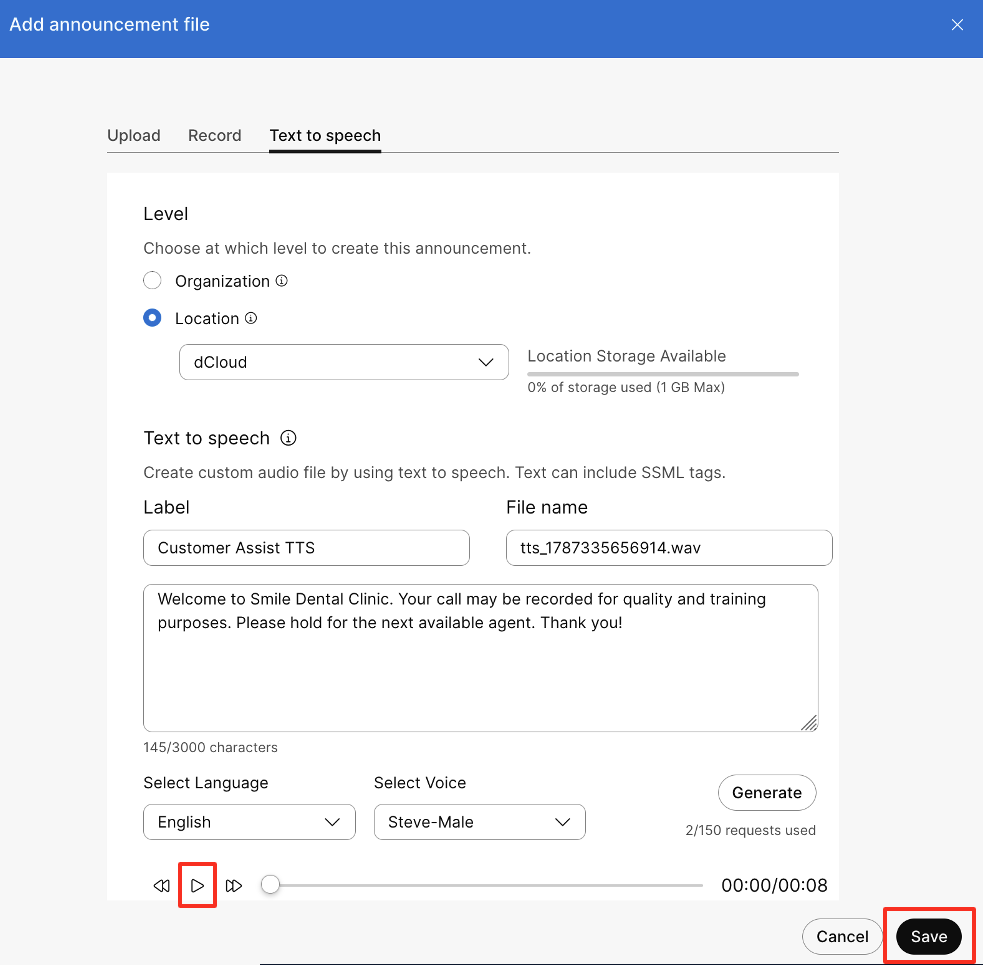
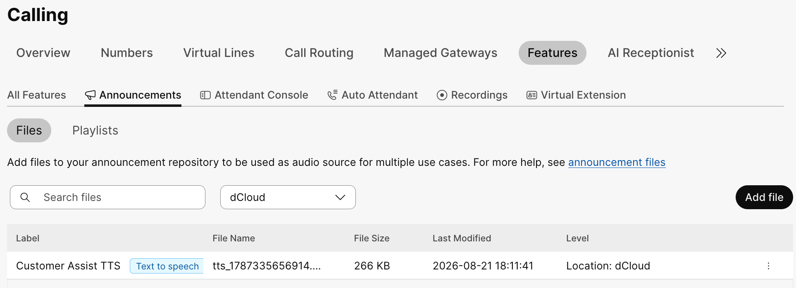

# Lab 3: Configure Webex Calling TTS Announcement [5 minutes]

1. From Control Hub portal, under Services, click on “**Calling**”.

2. Click on “**Features**” > click on “**Add New**” under the **Announcements** card.

    { .bordered }

3. Click on the “**Text to speech**” top menu

4. Configure fields as below:

    |  |  |
    | --- | --- |
    | **Level** | Location |
    | **Location [drop-down]** | dCloud |
    | **Label** | Customer Assist TTS |
    | **Enter your text here** | Welcome to Smile Dental Clinic. Your call may be recorded for quality and training purposes. Please hold for the next available agent. Thank you! |
    | **Select Language** | English |
    | **Select Voice** | Steve-Male |

    { .bordered }

5. Click “Generate” to create the audio file from the text provided above.

6. Click “Save”

    { .bordered }

    You can press the Play icon to play the generated announcement for verification and further edit prior to save.

7. List of Announcement files and type can be seen from the Announcement main menu.

    { .bordered }
