# Lab 4: Configure Webex Calling Customer Assist [20 minutes]

### Step 4.1: Create Customer Assist Queue

1. From Control Hub portal, under Services, click on “**Customer Assist**”.

2. Click on “**Queues**”

    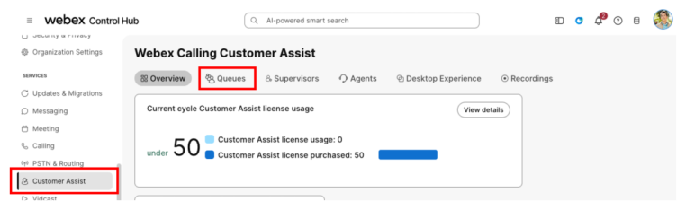

3. Click “**Add queue**”

    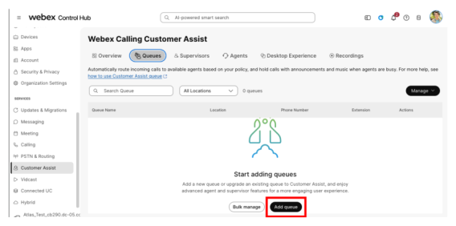

4. Configure fields as below for “Basics” section:

    |  |  |
    | --- | --- |
    | **Location** | dCloud |
    | **Queue Name** | Customer Assist Queue |
    | **Phone number: Extension** | 6801 |
    | **Dial By name** | Customer Assist |
    | **External caller ID phone number** | Location Number |

    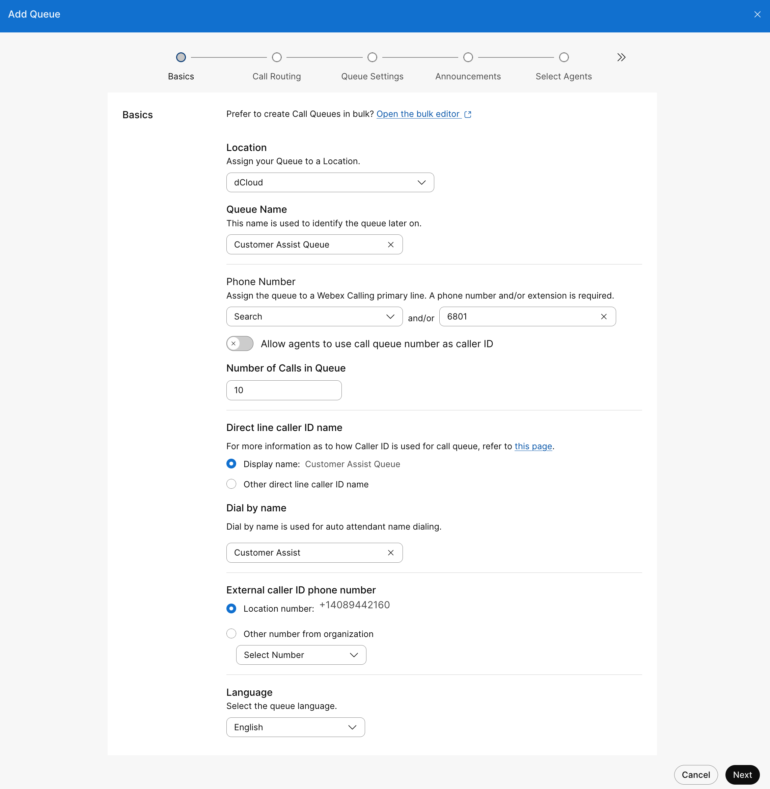

    Click “**Next**” to proceed to next section.

5. In Call Routing section, keep the default (Priority Based and Circular) selection. Click “Next” to continue.

    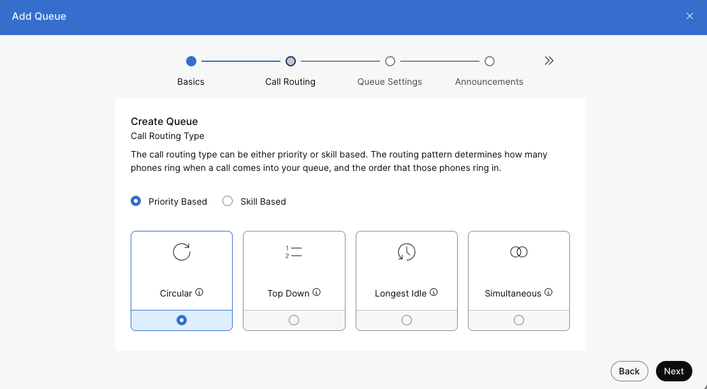

### Step 4.2: Configure Screen Pop

1. Click the toggle button to Configure Screen Pop.

    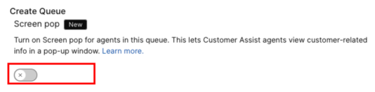{ .bordered }

2. Click “**Add new**” in query parameters:

    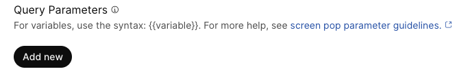{ .bordered }

3. Configure Screen pop as follow and then click “**Next**”

    |  |  |
    | --- | --- |
    | **Screen Pop URL** | http://crm.free.nf/index.php |
    | **Screen Pop Desktop Label** | Customer Assist CRM |
    | **Query Parameters: Key 1** | phone |
    | **Query Parameters: Value 1** | {{ "{{NewPhoneContact.ANI}}" }} |

    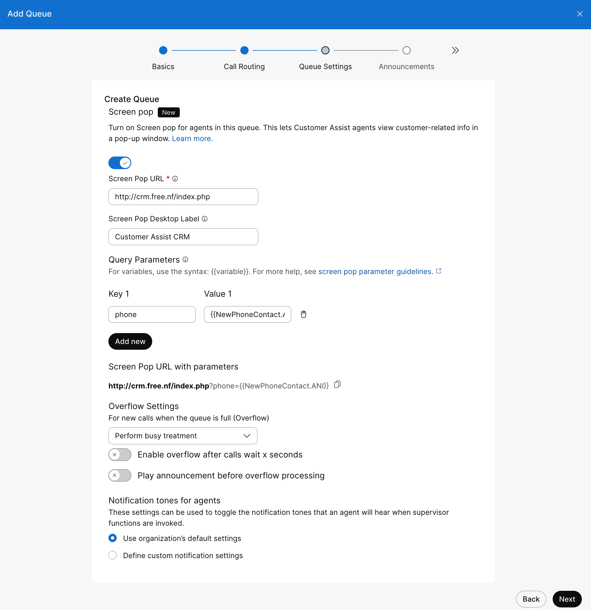

### Step 4.3: Configure Queue Announcements

1. In the Welcome Message section:

    * **Checked mark** on “Welcome message is mandatory”
    * Select “Custom Greeting” to use TTS Announcement created in Task 3.

2. Click “**Select File**” to use TTS Announcement file.

    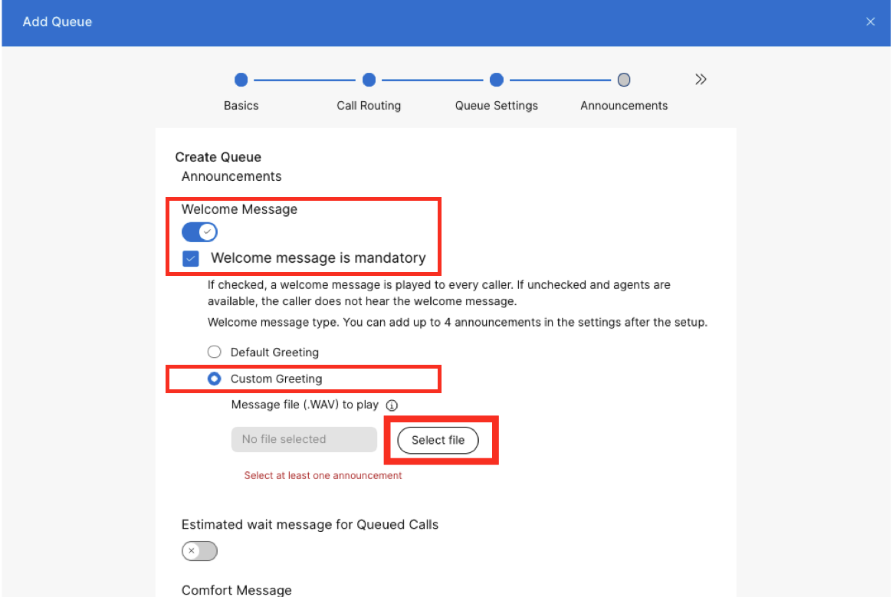

3. Left Click on “**dCloud Customer Assist TTS**” and then click “**Select file**”

    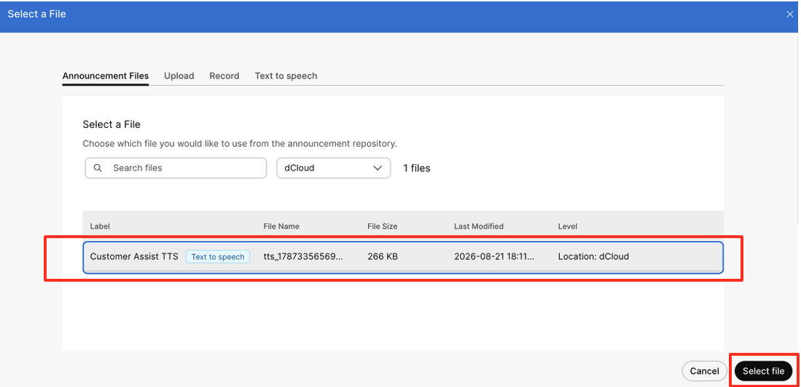{ width="753" }

    
⬇

    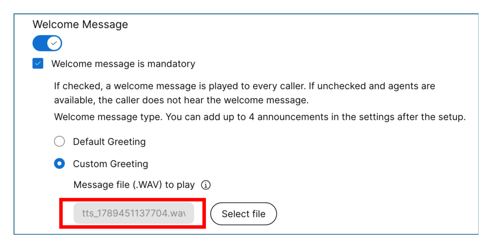{ width="754" }

4. Enable “Comfort Message” and “Hold Music”. Then click “**Next**”.

    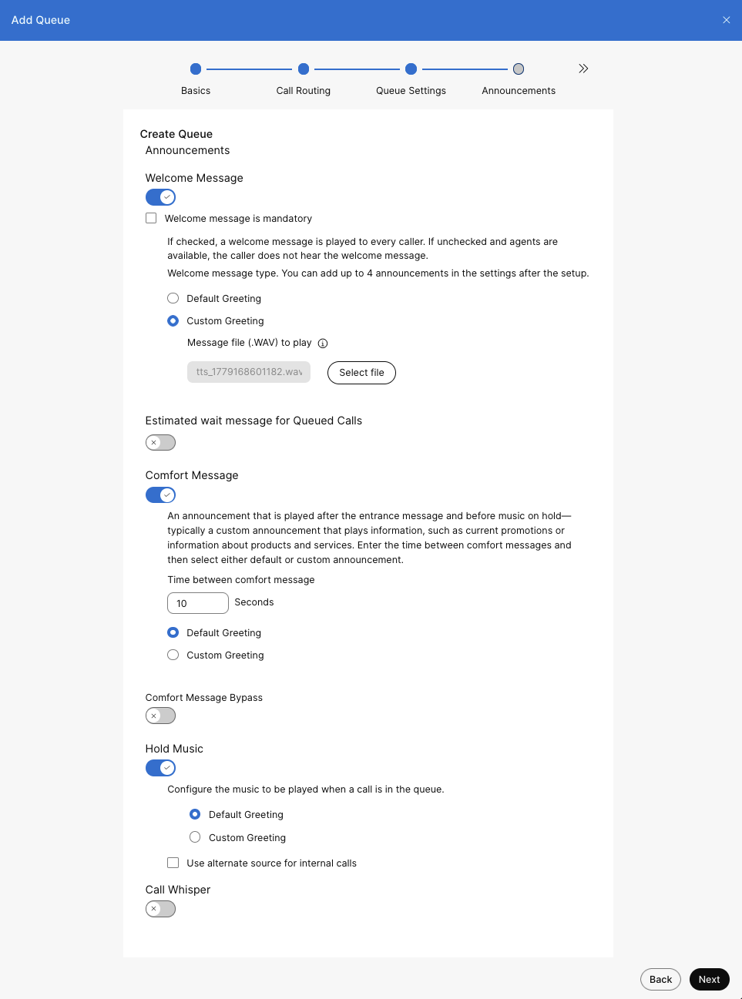

### Step 4.4: Select Agents

1. Add agents to Customer Assist Queue by selecting users from the “Search Users to add to queue” drop-down.

    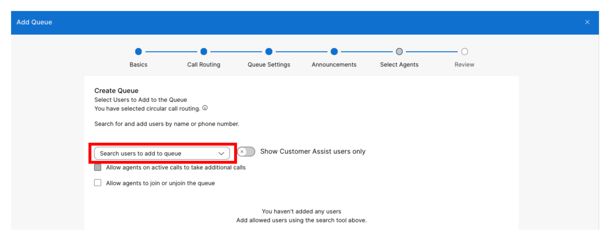{ width="960" }

2. Add “**Charles Holland**” and enabled “**Allow agents to join or unjoin the queue**”. Click “**Next**” when finished.

    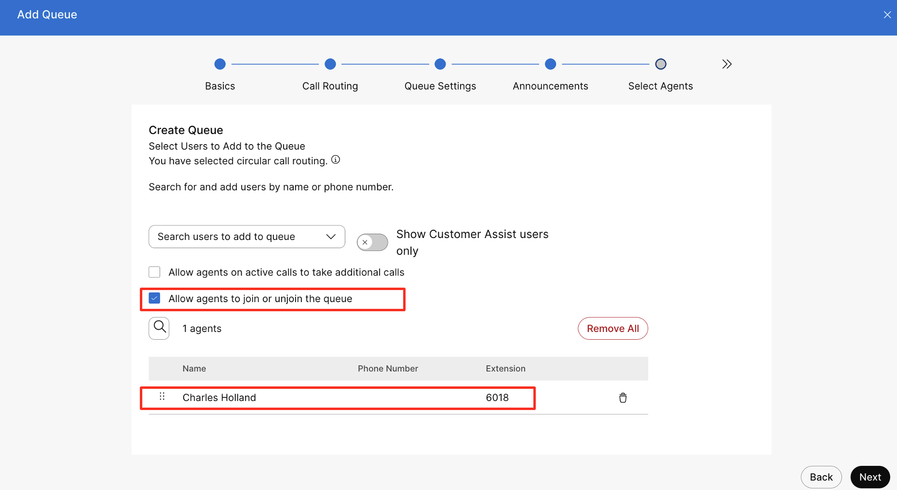{ width="960" }

3. Click “**Next**” to auto-assign Customer Assist license to Charles Holland.

    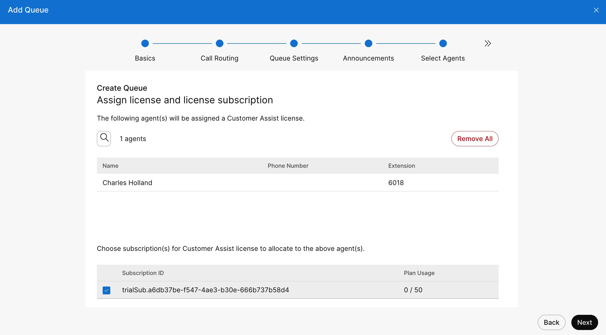{ width="960" }

4. Finally click on “**Create**” to add this Customer Assist queue.

    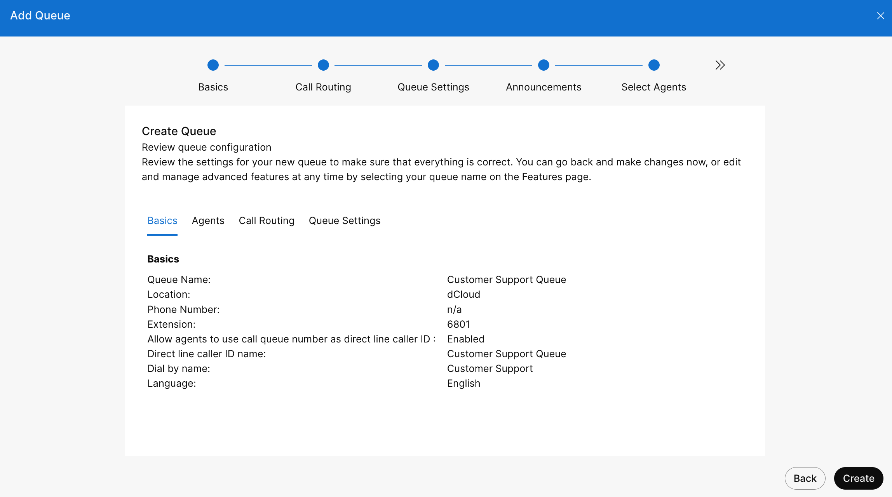{ width="960" }

5. Click “**Done**”

    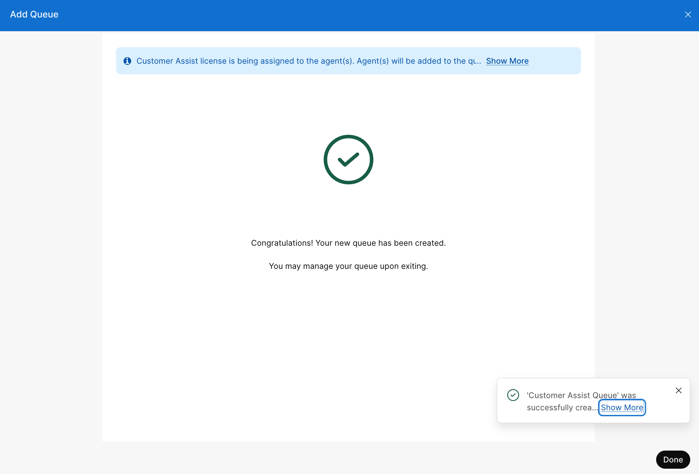{ width="960" }

6. List of Customer Assist Queue

    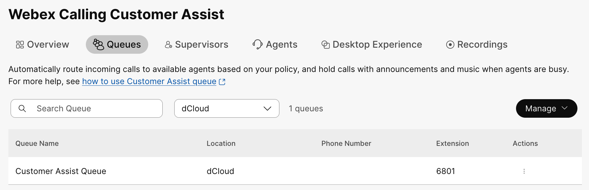{ width="960" }

### Step 4.5: Set the Agents to “Join” state

Agent’s status is defaulted to **Unjoin** when created. Each Agent needs to join a queue or queues to be able to accept calls that arrive in the queues.

1. From Customer Assist section, click on “**Agent**”.

    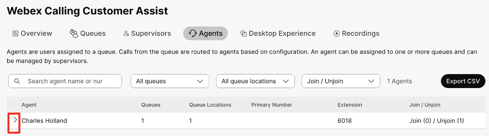{ width="960" }

2. Click on “**>**” as shown above to toggle agent’s status to “Join” by left click on “**Join**” button.

    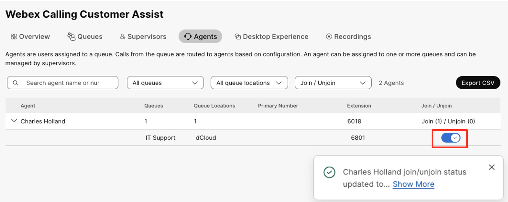{ width="960" }
