# Lab 5: Testing and Call Flow Validation [30 minutes]

We can now test and validate the AI Receptionist we built, let’s interact with it.

* If you recall our call flow we had designed, we assigned a PSTN number – “dCloud Main Location number” and an extension “6500” to the AI Receptionist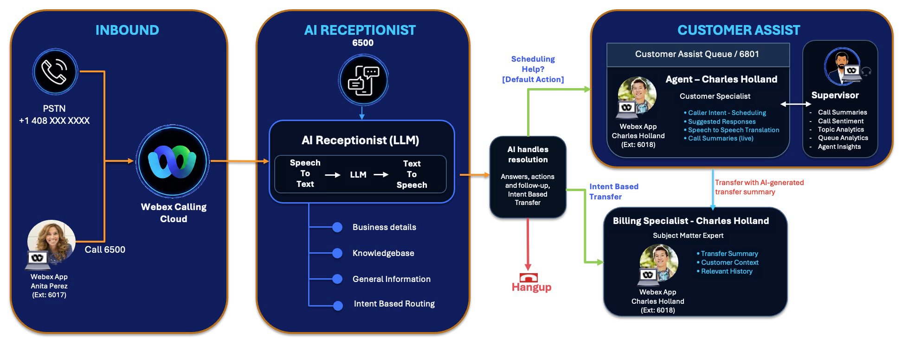{ .bordered }
* You can call the AI Receptionist using the PSTN number from your cell phone; however, we recommend using the Webex app and dial the extension “6500” to test.
* We are providing headset with microphone to attendees, if you have not received one, please reach out to one of the proctors to request one.
* To perform the validation, login as Anita Perez with Webex app in Lab PC and Charles Holland in Workstation1. Follow the table below on which workstation to login.
* User ID and password can be found in Task 1: Step 2 – Login Credentials for Control Hub.

Summary Below:

|  |  |  |  |
| --- | --- | --- | --- |
| User / Queue | Extension | Role | Workstation to use |
| Anita Perez | 6017 | Caller / Customer | Lab PC Webex app  Connect Headset in 3.5mm jack |
| AI Receptionist | 6500 | Smile Dental AI Receptionist | - |
| Customer Assist Queue | 6801 | Customer Support Queue | - |
| Charles Holland | 6018 | Billing Specialist/ Human Agent | Login from Workstation1 |

### Step 5.1: Login to Webex app as Anita Perez

1. Launch the Webex app from the main desktop view on the Lab PC by double-clicking the Webex app icon.

    Anita Perez will simulate a caller/customer from the PSTN (Call 6500 once login).

    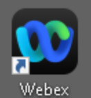{ .bordered }

2. Click the “Sign in” and use the user-id for the user as below:

    **Control Hub and Webex app userid**: [aperez@domain.com](mailto:aperez@domain.com) (userid@*domain\_name*)

    **Control Hub password:** dCloudxxxx!

    Refer to the Session Details (Task 1 – Step 2) for the user-id and password applicable for your session.

    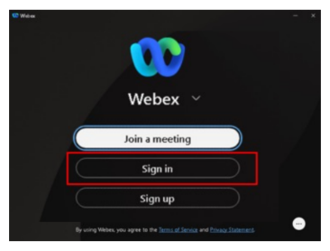{ .bordered } 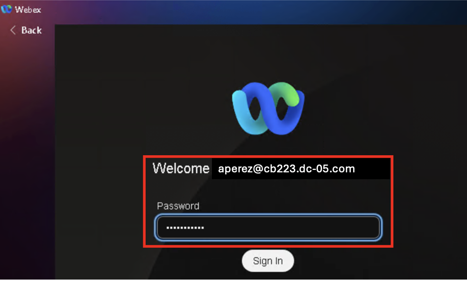{ .bordered }

3. Click the **two** **checkboxes** and select “**Allow Access**” to continue if you encountered this pop-up for Webex app – usually happened during first launch.

    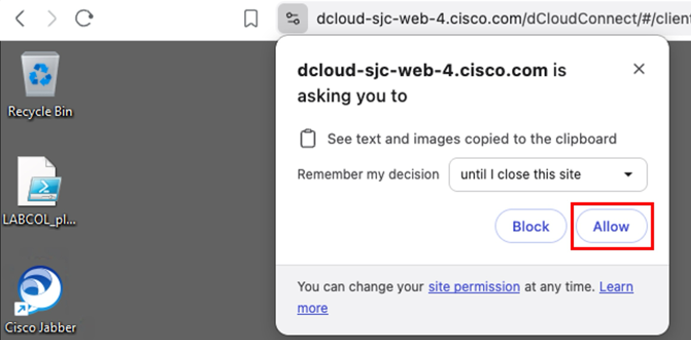{ .bordered }

4. Click “Agree” to continue if you encountered this disclaimer pop-up for Webex app – usually happened during first launch. It might ask you to relogin with username and password.

    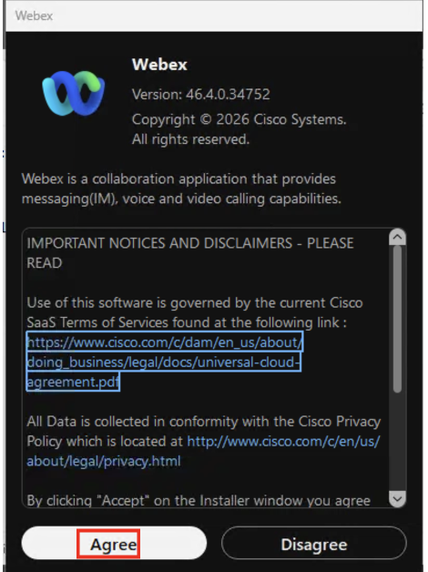{ .bordered }

5. Click “Ok” to acknowledge Emergency Calling Notification warning. Refer to the Appendix section to learn more about Emergency Calling for Webex Calling [out of scope for this lab].

    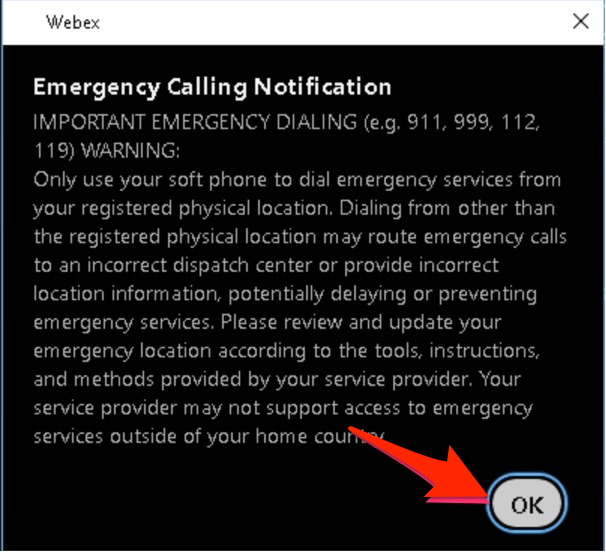{ .bordered }

6. Repeat the same steps to login as Charles Holland from workstation1, you would use [cholland@domain.com](mailto:cholland@domain.com) and password provided in Task1.

### Step 5.2: Call-in to AI Receptionist x6500

1. Once Anita Perez is logged in to Webex app, use Anita’s Webex app to make a call to AI Receptionist (x6500) for AI enabled interactions. Verify that Anita Perez is logged in to Webex app from Lab PC with headset connected to it.

2. Click on “Calling” button and type-in 6500 either 1] on the “Search or Dial” or 2] by pressing the dialer pad.

    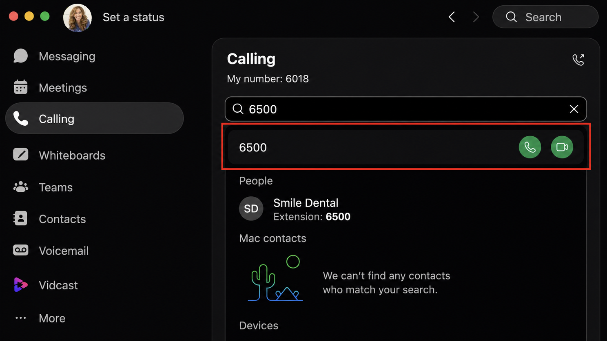{ .bordered }

3. Press the “handset” icon to initiate the call.

    |  |  |
    | --- | --- |
    | Typing 6500 in the “Search or dial” | Pressing 6500 on the Dialer pad |
    |  |  |

4. A call window will pop-up and you will hear the AI Receptionist greeting, start interacting with it.

    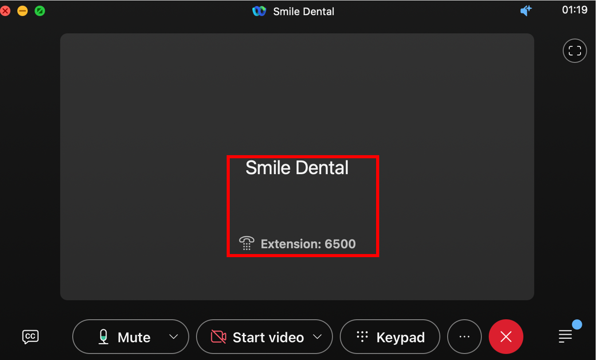{ .bordered }

5. Some example voice interactions examples you can use based on our Knowledge Base we have configured –

    * What are your hours?
    * What is your address?
    * Do you take credit cards?

6. Next start asking the AI Receptionist regarding billing and charges, something like below –

    * How much do you charge for cleaning?
    * How much do I pay out of my pocket?

7. The AI Receptionist will ask if it can transfer to the Billing Specialist, say Yes for that. You should see the call is getting transferred to Charles Holland who is our Billing Specialist as we have configured before.

    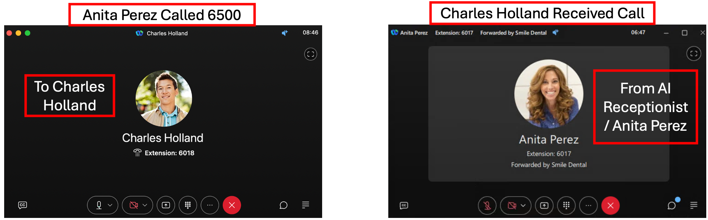{ .bordered }

8. Once call is connected hangup as you may not be able to hear anything, but this validates our Intent based routing.

9. Call “6500” again from Lab PC which is “Anita Perez” Webex app. Now try asking can you schedule an appointment for the weekend? The AI Receptionist will ask you if you want to talk to a scheduler, say Yes and it will transfer the call to Customer Assist queue where Charles Holland is our Agent who would answer the call from Workstation1.

10. Call “6500” again from Lab PC which is “Anita Perez” Webex app. Now try asking can you schedule an appointment? The AI Receptionist will ask you if you want to talk to a scheduler, say Yes and it will transfer the call to Customer Assist queue where Charles Holland is our Agent who would answer the call from Workstation1.

11. When you answer the call, you would notice a screen pop giving the information about customer which is a CRM integration feature available with Customer Assist.

    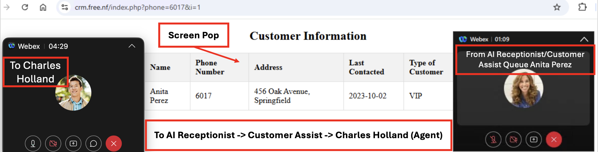{ .bordered }

### Step 5.3: Add Additional Knowledge Base

Let’s try updating the Knowledge Base to experience how AI Receptionist can answer most of the repeat questions by customers and avoid human interventions unless needed. We will use another method through the control hub native option without uploading the document.

1. Log back into the Control Hub navigate to the AI Receptionist under “Services -> Calling -> AI Receptionist”. Click on “Knowledge Base”-> “**Smile Dental**”.

    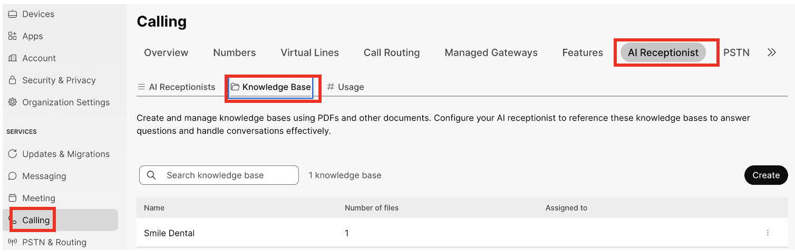{ .bordered }

2. Under Smile Dental Knowledge Base, click Add.

    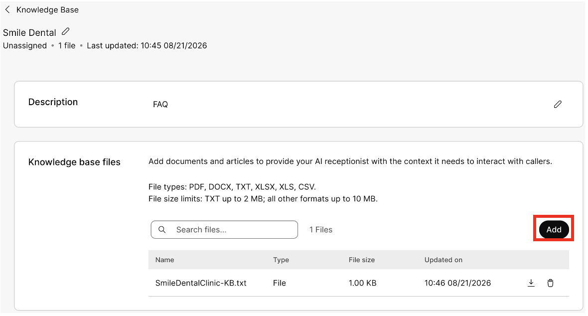{ .bordered }

3. This time instead of uploading a doc, we will create a text-based Knowledge Base with details below. Click on “**Create**” tab.

    |  |  |
    | --- | --- |
    | Name | Rates and Hours |
    | Enter Document Content | <ul style="list-style:none; padding-left:0; margin:0;"><li>1. Service Fee estimate:<ul><li>Prices below is for quantity one and before insurance.</li><li>Dental Cleaning - $100</li><li>Root Canal - $500</li><li>Crown - $1000</li></ul></li><li>2. Selected Weekend Hours Availability<ul><li>Smile Dental Clinic is open on selected weekends, this weekend we are open between 9am to 1pm and walk-ins are welcome.</li><li>For other weekend appointments, please check with an agent.</li></ul></li></ul> |

4. Once done, click Add.

    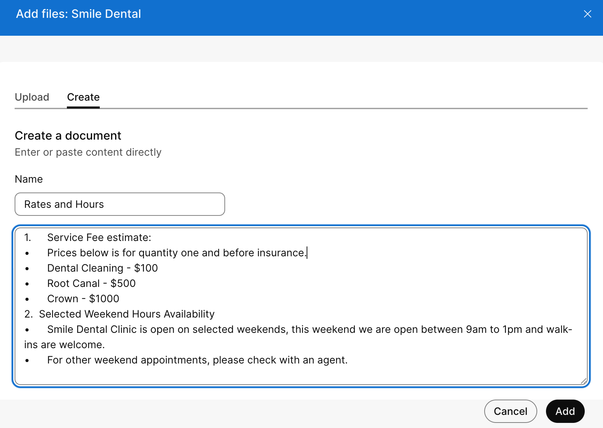{ .bordered }

5. Now there will be two files under Smile Dental Knowledge Base – 1. File based and 2. Article based

    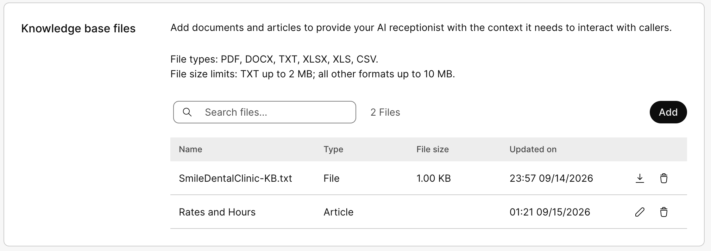{ .bordered }

    |  |  |
    | --- | --- |
    |  | Sometimes the KB processing after upload might take times (especially for large KB) and indicated by a spinning circle. Please give it few minutes for it to complete upload and content analysis. |

6. Back to Anita Perez Webex app, and you can start interacting with AI Receptionist by calling “6500”. This time start asking questions such as below –

    * Can I get an appointment this weekend?
    * How much do you charge for cleaning service?

    This time you would notice the AI Receptionist answered the questions regarding billing and extended scheduling without needing to transfer to the human representatives.

7. Note: Responding "No" when the AI Receptionist asks "Is there anything else I can help you with?" will automatically end the call.

### Step 5.4: Change AI Receptionist Language

AI Receptionist offers multiple languages to support several Geos, to change and test the language follow the steps below –

1. From Control Hub portal, in Services > “**Calling**” > “AI Receptionist”.

2. Select Smile Dental and then click “Language and voice” line.

    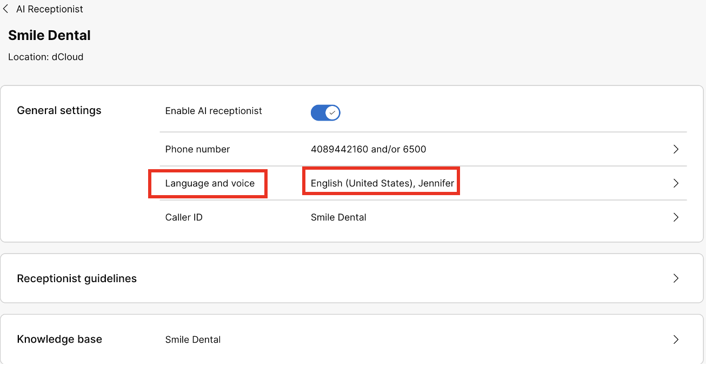{ .bordered }

3. Select AI Receptionist Language as “Spanish (Mexico) and select the AI receptionist voice as “Luna”, once selected click “Save”.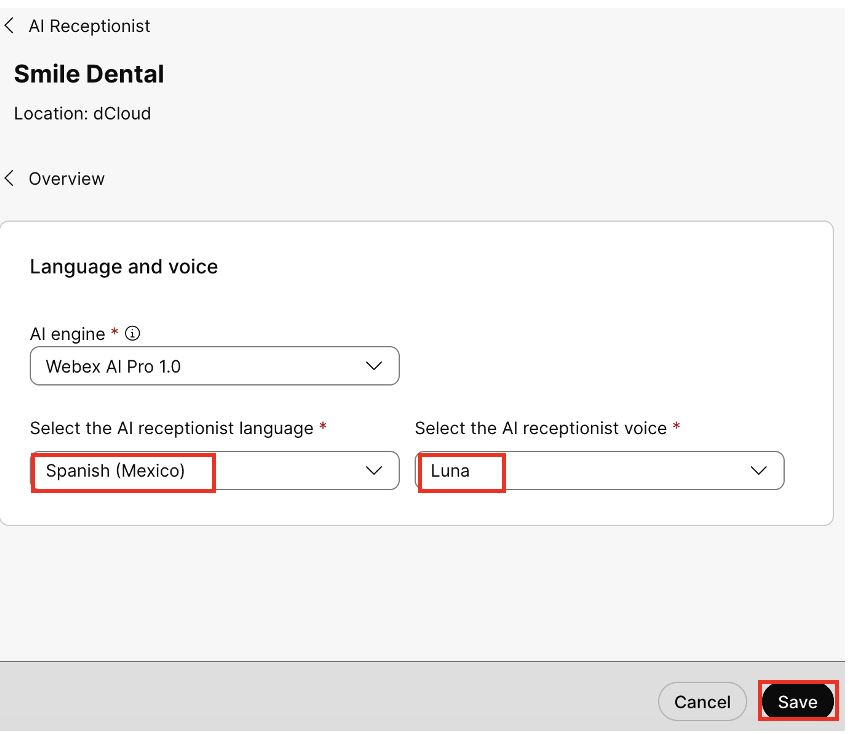{ .bordered }

4. From the Lab PC call “6500” again from “Anita Perez” Webex app. AI Receptionist will respond in the written language for Welcome Message, but subsequent interaction will be in Spanish such as –

    * Habla espanol? (Do you speak Spanish?)
    * ¿Cuál es su dirección? (What is your address?)

5. You can hang up once you finish testing the interactions.

### Step 5.5: Monitor AI Receptionist Usage

To monitor AI Receptionist usage, you can go to the Control Hub under AI Receptionist you would see a tab for “Usage”.

* The trials have entitlement to 2 bundles of AI receptionist agent. Each entitlement provides 500 minutes of usage.
* The usage is tracked in seconds, with the minimum consumption unit being 1 second.
* Review the usage summary for the current billing cycle.
* The usage view can include the total entitlement, consumed usage, remaining usage, and the billing cycle for which usage is displayed.
* Use the usage summary to identify whether the organization is approaching its entitlement limit.
* The AI Receptionist report helps administrators understand how AI Receptionist is handling calls across the organization. Use the report to see whether callers are reaching AI Receptionist, whether calls are being answered, how often calls are transferred, and whether transfers succeed.

    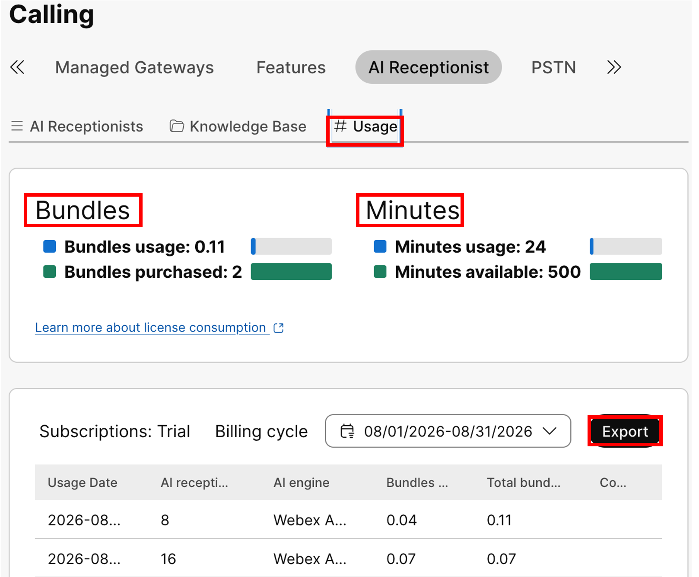{ .bordered }

* The report is useful when you want to evaluate front desk automation, compare performance across receptionists or locations, and identify configuration improvements. For example, a low intent-transfer rate may indicate that intents need clearer descriptions, while a low transfer success rate may indicate that transfer destinations, operating hours, or routing configuration need review.

Please click “**Logout and Release Station**” to release the session to next lab participants. Thank You!

+++++++++++++++++++++++++++++++++++++++++++++++++++++++++++++++++++++++++++++++++++

**Congratulations, you have finished this fantastic “Transform Customer Engagement: Mastering Webex AI Receptionist with Customer Assist” lab.**

Please fill out the survey in your Cisco Live app under “My Surveys” section to receive a copy of this lab guide.

**To learn more about Webex Calling, Customer Assist at WebexOne 2026:**

* **CLS-11089: Level Up Your Customer Service: Webex Calling Customer Assist**
* **LAB-11169: Webex Calling Customer Assist Hands-On Lab**
* **CLS-21076: Webex Calling Customer Assist: Smarter Support, Made Simple**

**Online References:**

**Webex Calling AI Receptionist:**

[**https://help.webex.com/en-us/article/4chov0/AI-Receptionist-in-Webex-Calling**](https://help.webex.com/en-us/article/4chov0/AI-Receptionist-in-Webex-Calling)

**Webex Calling Customer Assist:**

[**https://help.webex.com/en-us/article/72sb3r/Webex-Calling-Customer-Assist**](https://help.webex.com/en-us/article/72sb3r/Webex-Calling-Customer-Assist)

[**https://help.webex.com/en-us/article/nc8142w/Get-started-with-Webex-Calling-Customer-Assist-for-Supervisors**](https://help.webex.com/en-us/article/nc8142w/Get-started-with-Webex-Calling-Customer-Assist-for-Supervisors)

+++++++++++++++++++++++++++++++++++++++++++++++++++++++++++++++++++++++++++++++++++

[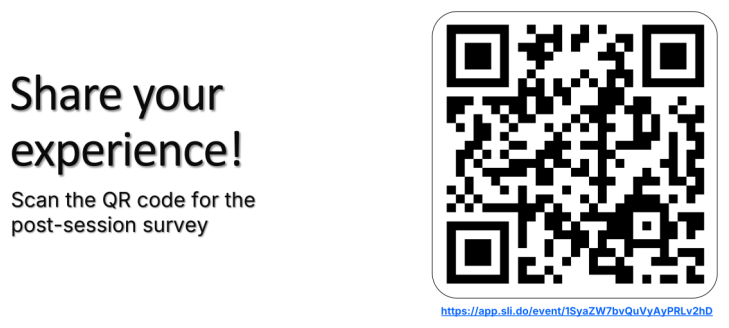{ .bordered }](https://app.sli.do/event/1SyaZW7bvQuVyAyPRLv2hD)
