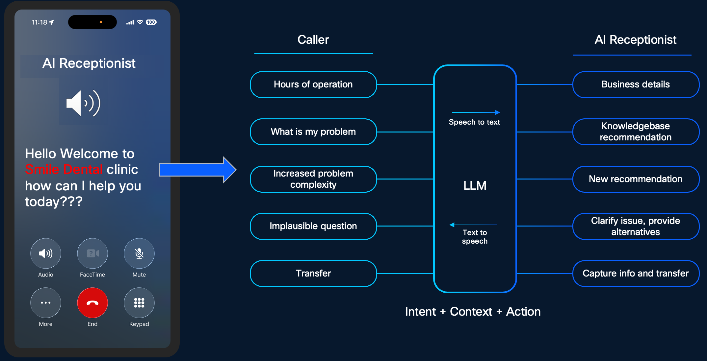

# Lab Overview

In this lab, participants will gain hands-on experience in modernizing front-desk operations using the Webex Calling AI Receptionist. As businesses face increasing pressure to balance high-quality customer service with limited staffing and budget constraints, AI-driven automation has become a critical tool for operational efficiency.

This lab provides a comprehensive walkthrough of the AI Receptionist deployment lifecycle within the Collaboration Control Hub. Attendees will move beyond basic call routing to implement an intelligent, LLM-powered assistant capable of understanding caller intent, providing context-aware information, and executing automated actions.

How AI Receptionist can help your customers and users, here is an example we have built and you would configure AI Receptionist by yourself in this lab.

You need to see a Dentist, you found there is nearby Dentist available, but it is after hours and you need the information about services they offer and possibly insurance with pricing details. You are out of the luck as the clinic is closed, but not the AI Receptionist which is an interactive agent available 24X7. It can answer most of the customer queries based on the knowledge base is configured.

{ .bordered }

**Imagine this situation:**

It’s late in the evening, and you suddenly realize you need to see a dentist. Maybe it’s a sharp toothache, or you’ve been putting off a routine checkup for too long. You quickly search online and find a nearby dental clinic that looks promising.

There’s just one problem—the clinic is closed.

You still have important questions:

* What services do they offer?
* Do they accept your insurance?
* How much will a consultation cost?
* When is the earliest appointment available?

Traditionally, you’d have to wait until the next business day to get answers. This delay can be frustrating and may even lead you to look elsewhere.

Now imagine a different experience.

Instead of hitting a dead end, you’re greeted by an AI Receptionist—a smart, conversational assistant available 24/7.

This AI Receptionist can:

* Answer questions about services like cleanings, fillings, or emergency care
* Provide general pricing information
* Share accepted insurance providers
* Help you understand clinic hours and availability
* Guide you toward booking an appointment

All of this happens instantly, even outside business hours. And during the normal business hours call can be transferred to an operator or a queue.

If you are calling during normal business hours you can front end the main number with AI Receptionist and answer customers repetitive queries and if required, you can transfer it to a live agent who can help customer with scheduling and any other queries. If you have a 24X7 customer experience team by using AI Receptionist, you can reduce their workload by providing answers to the common questions using AI Receptionist.

Why This Matters:

* An AI Receptionist isn’t just a convenience—it’s a powerful tool that helps businesses:
* Never miss a customer inquiry
* Provide instant support around the clock
* Reduce workload on human staff
* Deliver a modern, responsive customer experience
* With AI Receptionist and Customer Assist combination enrich the customer experience

### What You Will Build in This Lab:

In this lab, you will step into the role of a solution designer and configure your own AI Receptionist along with Customer Assist for a dental clinic.

{ .bordered }

You will configure the AI Receptionist with Customer Assist so that when a “customer” interacts with it—just like in the scenario above—it can confidently answer questions and guide them effectively. If required AI Receptionist can transfer the call to a specialist or an Agent configured with Customer Assist.

Think of it this way:

You’re not just building a chatbot—you’re creating the first point of contact for a patient in need.

Let’s begin with how to Access the Lab –

{ .bordered }
